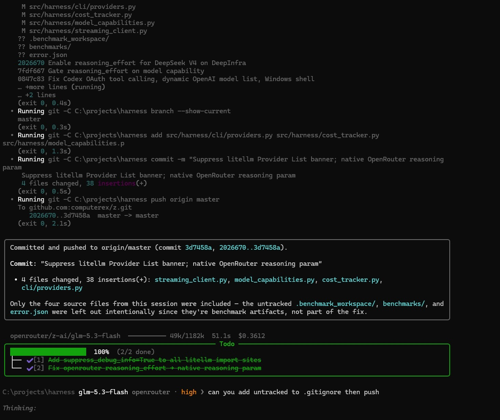

# z

<p align="center">
  
</p>

An agentic coding harness for the terminal. Bring your own API keys — hot-swap models mid-session with `/providers use`. No subscriptions.

## Quick start

```bash
pip install -e .
z --install   # one-time setup wizard
z
```

Config lives in `~/.z.json`:

```json
{ "api_url": "https://api.z.ai/api/paas/v4/", "api_key": "sk-...", "model": "glm-4.7" }
```

## Highlights

- **26 providers, one client** — Z.AI, DeepSeek, Anthropic, OpenAI, Ollama, Bedrock, Copilot OAuth, OpenRouter, all via LiteLLM.
- **Constant streaming** — every token, including reasoning, streams live. No spinners.
- **Telegram remote** — `z --telegram <token>` and drive the agent from your phone.
- **Context that survives compaction** — half/quarter/lastTwo strategies, todo persistence, tool-result caching.
- **Claude Code semantics** — CLAUDE.md, hooks, persistent memory, cron tasks, sub-agents, MCP.
- **19 built-in tools** — file ops, shell, search, web search, image analysis, background processes.

## Commands

| Command | What |
|---|---|
| `/providers use <name>` | Switch models mid-session |
| `/compact` | Force context compaction |
| `/cost` | Token usage and spend |
| `/todo` | Todo panel |
| `!cmd` | Run shell command |
| `Ctrl+T` | Toggle reasoning effort |

Plugins: drop a `.py` in `~/.z/plugins/`.

MIT
